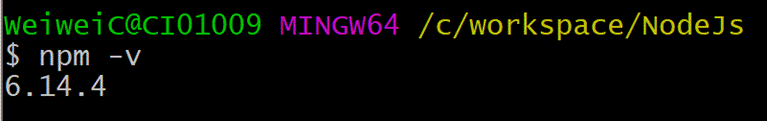
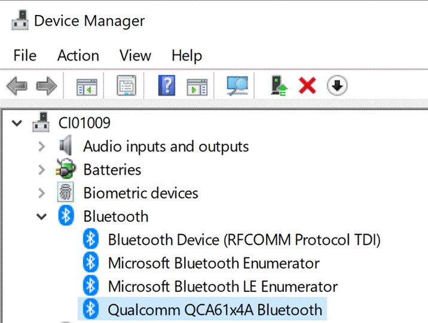
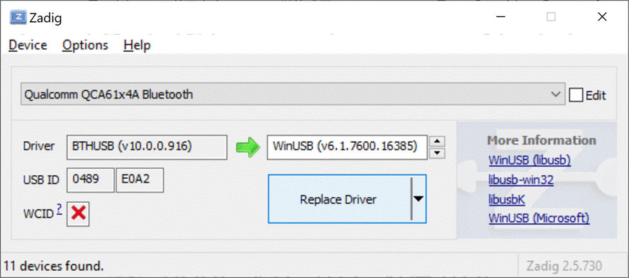
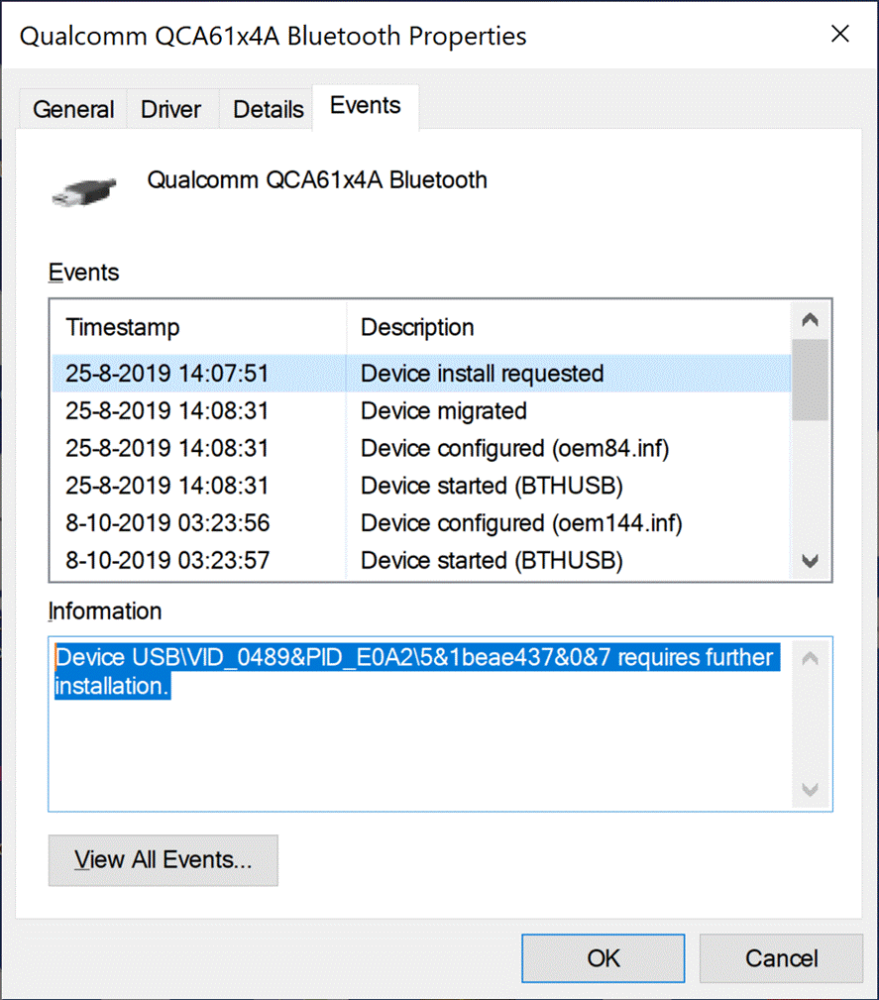
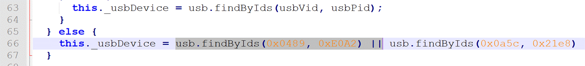

## Overview
Xsens DOT Server is a simple web server that can scan, connect and start measurement with Xsens DOT.

## Documentation
* [System Architecture](documentation/XsensDOTServer-SystemArchitecture.pdf): system architecture of Xsens DOT Server.
* [Sensor Server](documentation/XsensDOTServer-SensorServer.pdf): application and workflow control.
* [BLE Handler](documentation/XsensDOTServer-BLEHandler.pdf): creates an abstraction from the BLE protocol.
* [Web GUI Handler](documentation/XsensDOTServer-WebGUIHandler.pdf): the web server
* [Noble](https://github.com/noble/noble): Node package that implements an interface with the BLE radio (i.e. driver).
* [Web Client](documentation/XsensDOTServerWebClient.pdf): a web browser that can run on any computer on the local network and that renders an HTML page that implements the GUI.

## Setting up the environment
* [Windows](#windows)
* macOS
* Rasberry Pi

### Set up on Windows
#### Prerequisites
* Windows 10, 64-bit
* Compatible Bluetooth 4.0 USB adapter or above

#### Install the following tools
* Install [Node.js-v12.16.2-x64](https://nodejs.org/download/release/v12.16.2/node-v12.16.2-x64.msi))
  * Keep clicking **Next** to complete the installation.
  * Enter `npm -v` in command prompt to check if the installation is successful. 
&nbsp;

* Install [node-gyp](https://github.com/nodejs/node-gyp#installation)
   
   `npm install -g node-gyp`

* Install Python 3.8.3 from the [Micfrosoft Store package](https://docs.python.org/3/using/windows.html#the-microsoft-store-package) 

* Install all the required tools and configurations using Microsoft's [windows-build-tools](https://github.com/felixrieseberg/windows-build-tools) from an elevated PowerShell or CMD.exe (run as Administrator):

  `npm install --global --production windows-build-tools`
  
* Install [Zadig](https://zadig.akeo.ie/) to setup WinUSB driver:
  * Find Bluetooth adapter inforamtion in Device Manager  
&nbsp;
  * Open Zadig, goto **Options**, enable "**List All Devices**"
  * Find your Bluetooth adapter, change the driver to **WinUSB**. Then click **Replace Driver**  
&nbsp;

  * Note: please retry several times if the intallation fails. Or restart the computer and try again. 
* Clone repository:
  
  `git clone https://github.com/xsens/xsens_dot_server.git`
  
* Enter Xsens DOT Server project and install the dependency package: `xxxx` and then `npm install`

#### Run Xsens DOT Server

`node xsensDotServer`
If you encounter `Error: No compatible USB Bluetooth 4.0 device found!`
 1. Find the VID and PID of your Bluetooth device 
&nbsp;
 2. Open source code: *XsensDOTserver\node_modules\bluetooth-hci-socket\lib\usb.js*
 3. Add Bluetooth VID & PID in usb.js (line 66) 
&nbsp;
 4. Run Xsens DOT Server again

#### Open Xsens DOT server in browser
Run http://localhost:8080/ and you are able to use Xsens DOT Server!
