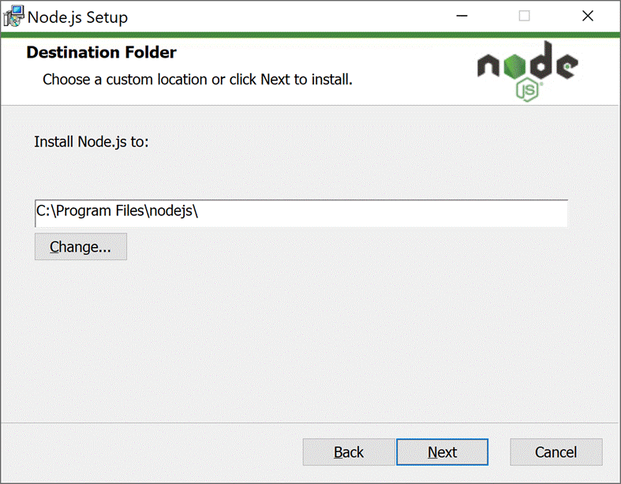
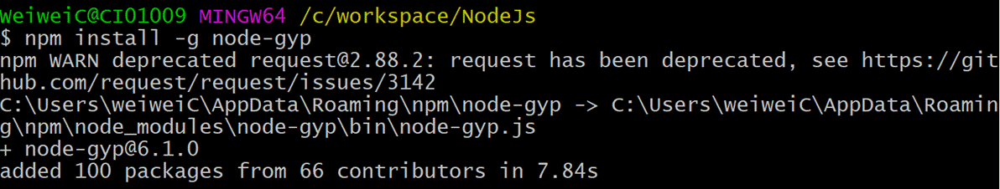
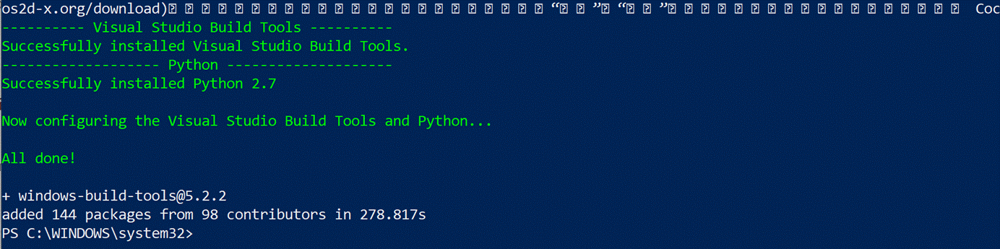

## Xsens DOT Server

## Documentation
* [Setup Guide](#setup-guide)

## Setup Guide
### Windows
#### Prerequisites
#### Install **Node.js** ([node-v12.16.2-x64.msi](https://nodejs.org/download/release/v12.16.2/node-v12.16.2-x64.msi))
1. Keep clicking **Next** to complete the installation.

2. Enter `npm -v` in command prompt to check if the installation is successful.

#### Install [node-gyp](https://github.com/nodejs/node-gyp#installation) - Node.js native addon build tool
* `npm install -g node-gyp`

#### Install [noble](https://github.com/abandonware/noble) - A Node.js BLE (Bluetooth Low Energy) central module
* Install windows-build-tools from an elevated PowerShell or cmd.exe (**run as Administrator**).
`npm install --global --production windows-build-tools`

#### Use [Zadig](https://zadig.akeo.ie/) to setup WinUSB driver
1. Find Bluetooth adapter inforamtion in Device Manager

2. Download and open Zadig, goto **Options**, enable "**List All Devices**"

3. Find your Bluetooth adapter, change the driver to **WinUSB**. Then click **Replace Driver**

Note: please retry several times if the intallation fails. Or try to restart the computer and try again. 

